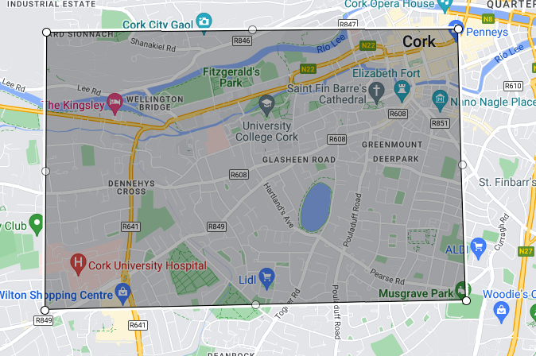
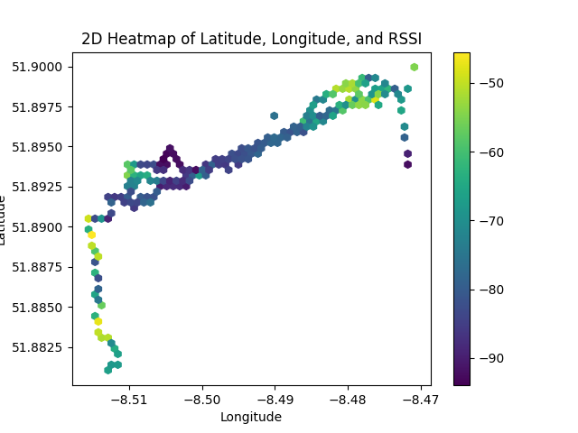

# Mobile Signal Data

## Explanation
The purpose of this is to create a predictive model to figure out the mobile signal power (RSSI) for a longitude and
latitude in the city of Cork, Ireland.

## Dataset
It is formed by around 31.000 records that associate a RSSI for a Latitude and a Longitude

[Dataset](https://www.kaggle.com/datasets/aeryss/lte-dataset) obtained from Kaggle

## Model
After tried with several ML models as Linear and Polygonal Regression, the Decision Tree Regressor was choosen comparing
the scores.
Scores were obtained by mean squared error, splitting the dataset in training and testing subsets.